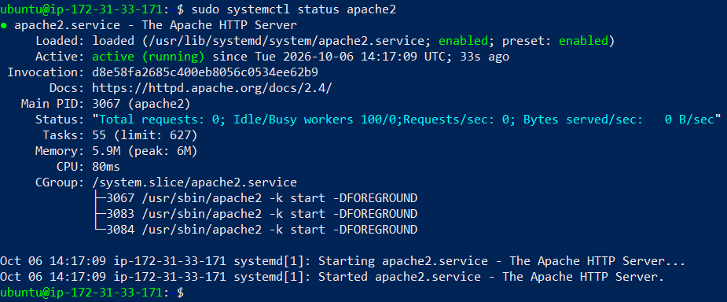
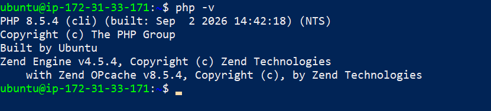
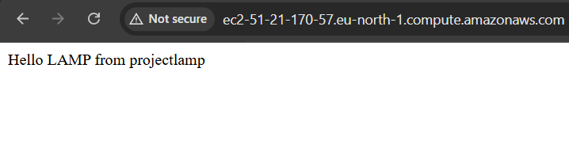
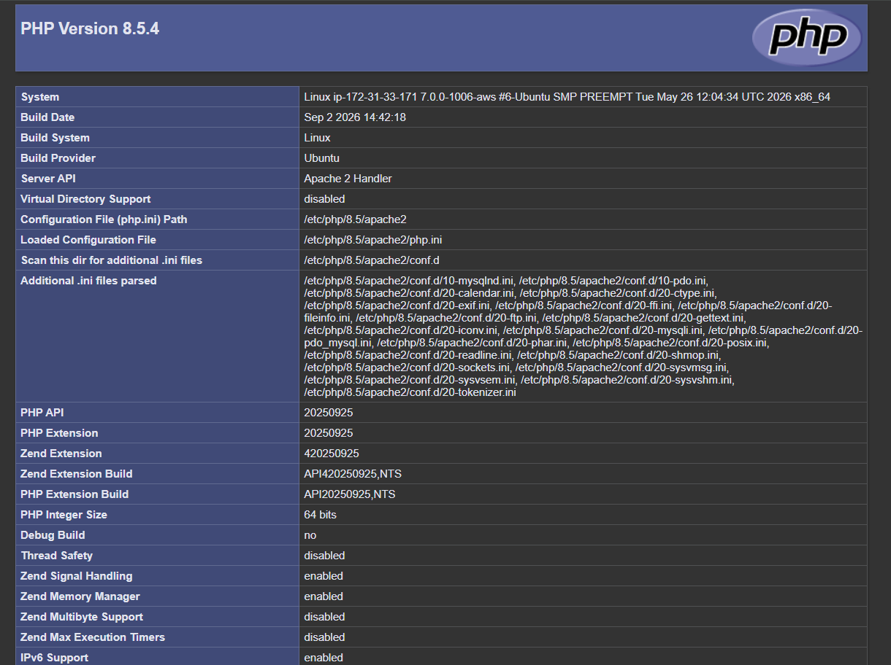

## Documentation of project 1

`STEP 1_INTSALLING APACHE AND UPDATING THE FIREWALL`
What exactly is Apache?

Apache HTTP Server is the most widely used web server software. Developed and maintained
by Apache Software Foundation, Apache is an open-source software available for free. It runs on
67% of all webservers in the world. It is fast, reliable, and secure. It can be highly customized to
meet the needs of many different environments by using extensions and modules. Most
WordPress hosting providers use Apache as their web server software. However, websites and
other applications can run on other web server software as well. Such as Nginx, Microsoft’s IIS,
etc.

The Apache web server is among the most popular web servers in the world. It’s well
documented, has an active community of users, and has been in wide use for much of the history
of the web, which makes it a great default choice for hosting a website.

Install Apache using Ubuntu’s package manager ‘apt’:

Update a list of packages in package manager

`sudo apt update`

Run apache2 package installation:

`sudo apt install apache2`

To verify that apache2 is running as a Service in our OS, use following command:

`sudo systemctl install apache2`

- [install openssh](https://learn.microsoft.com/en-us/windows-server/administration/openssh/openssh_install_firstuse?tabs=gui&pivots=windows-11)

- [openssh key management](https://learn.microsoft.com/en-us/windows-server/administration/openssh/openssh_keymanagement)

`STEP 2_INSTALLING MYSQL`

use ‘apt’ to acquire and install this software:
`sudo apt install mysql-server`

When the installation is finished, log in to the MySQL console by typing:
`sudo mysql`

Exit the mysql shell with:
`exit`

When you’re finished, test if you’re able to log in to the MySQL console by typing:
`sudo mysql -p`

and exit the console:
`exit`

My MySQL server is now installed and secured. Next, we will install PHP, the final component
in the LAMP stack.

`STEP 3_INSTALLING PHP`

PHP is the component of our setup that will process code to display dynamic content to the
end user. In addition to the php package, you’ll need php-mysql, a PHP module that allows PHP
to communicate with MySQL-based databases. You’ll also need libapache2-mod-php to enable
Apache to handle PHP files. Core PHP packages will automatically be installed as dependencies.

To install this 3 packages at once, run:
`sudo apt install php libapache2-mod-php php-mysql`

At this point, my LAMP stack is completely installed and fully operational.

`STEP 4 — CREATING A VIRTUAL HOST FOR YOUR WEBSITE USING APACHE`

In this project, you will set up a domain called projectlamp, but you can replace this with any
domain of your choice.
Apache on Ubuntu 20.04 has one server block enabled by default that is configured to serve
documents from the /var/www/html directory.
We will leave this configuration as is and will add our own directory next next to the default one.

Create the directory for projectlamp using ‘mkdir’ command as follows:
`sudo mkdir /var/www/projectlamp`

Next, assign ownership of the directory with your current system user:
`sudo chown -R $USER:$USER /var/www/projectlamp`

Then, create and open a new configuration file in Apache’s sites-available directory using your
preferred command-line editor. Here, we’ll be using vi or vim (They are the same by the way):
`sudo vi /etc/apache2/sites-available/projectlamp.conf`

This will create a new blank file. Paste in the following bare-bones configuration by hitting
on i on the keyboard to enter the insert mode, and paste the text:
`
<VirtualHost *:80>
 ServerName projectlamp
 ServerAlias www.projectlamp
 ServerAdmin webmaster@localhost
 DocumentRoot /var/www/projectlamp
 ErrorLog ${APACHE_LOG_DIR}/error.log
 CustomLog ${APACHE_LOG_DIR}/access.log combined
</VirtualHost>
`
With this VirtualHost configuration, we’re telling Apache to
serve projectlamp using /var/www/projectlampl as its web root directory. If you would like to
test Apache without a domain name, you can remove or comment out the options ServerName
and ServerAlias by adding a # character in the beginning of each option’s lines. Adding
the # character there will tell the program to skip processing the instructions on those lines.

You can now use a2ensite command to enable the new virtual host:
`sudo a2ensite projectlamp`

You might want to disable the default website that comes installed with Apache. This is required
if you’re not using a custom domain name, because in this case Apache’s default configuration
would overwrite your virtual host. To disable Apache’s default website use a2dissite command,
type:
`sudo a2dissite 000-default`

To make sure your configuration file doesn’t contain syntax errors, run:
`sudo apache2ctl configtest`

Finally, reload Apache so these changes take effect:
`sudo systemctl reload apache2`

Your new website is now active, but the web root /var/www/projectlamp is still empty. Create
an index.html file in that location so that we can test that the virtual host works as expected:
`sudo echo 'Hello LAMP from hostname' $(curl -s
http://169.254.169.254/latest/meta-data/public-hostname) 'with public IP' $(curl -s
http://169.254.169.254/latest/meta-data/public-ipv4) > /var/www/projectlamp/index.html`

Now go to your browser and try to open your website URL using IP address:
`http://<Public-IP-Address>:80`

If you see the text from ‘echo’ command you wrote to index.html file, then it means your
Apache virtual host is working as expected.
In the output you will see your server’s public hostname (DNS name) and public IP address. You
can also access your website in your browser by public DNS name, not only by IP – try it out,
the result must be the same (port is optional)
`http://<Public-DNS-Name>:80`

You can leave this file in place as a temporary landing page for your application until you set up
an index.php file to replace it. Once you do that, remember to remove or rename
the index.html file from your document root, as it would take precedence over an index.php file
by default.

`STEP 5 — ENABLE PHP ON THE WEBSITE`

With the default DirectoryIndex settings on Apache, a file named index.html will always take
precedence over an index.php file. This is useful for setting up maintenance pages in PHP
applications, by creating a temporary index.html file containing an informative message to
visitors. Because this page will take precedence over the index.php page, it will then become the
landing page for the application. Once maintenance is over, the index.html is renamed or
removed from the document root, bringing back the regular application page.
In case you want to change this behavior, you’ll need to edit
the /etc/apache2/mods-enabled/dir.conf file and change the order in which the index.php file is
listed within the DirectoryIndex directive use any vitual editor you prefere for me i we use vi or vim:
`sudo vim /etc/apache2/mods-enabled/dir.conf`

then:
`#Change this:
 #DirectoryIndex index.html index.cgi index.pl index.php index.xhtml index.htm`
`#To this:
DirectoryIndex index.php index.html index.cgi index.pl index.xhtml index.htm`

After saving and closing the file, you will need to reload Apache so the changes take effect:
`sudo systemctl reload apache2`

Finally, we will create a PHP script to test that PHP is correctly installed and configured on your
server.
Now that you have a custom location to host your website’s files and folders, we’ll create a PHP
test script to confirm that Apache is able to handle and process requests for PHP files.
Create a new file named index.php inside your custom web root folder:
`vim /var/www/projectlamp/index.php`

This will open a blank file. Add the following text, which is valid PHP code, inside the file:
`<?php
phpinfo();
`

When you are finished, save and close the file, refresh the page and you will see a page similar to
this:

This page provides information about your server from the perspective of PHP. It is useful for
debugging and to ensure that your settings are being applied correctly.
If you can see this page in your browser, then your PHP installation is working as expected.

After checking the relevant information about your PHP server through that page, it’s best to
remove the file you created as it contains sensitive information about your PHP environment
-and your Ubuntu server. You can use rm to do so:
`sudo rm /var/www/projectlamp/index.php`

You can always recreate this page if you need to access the information again later.

